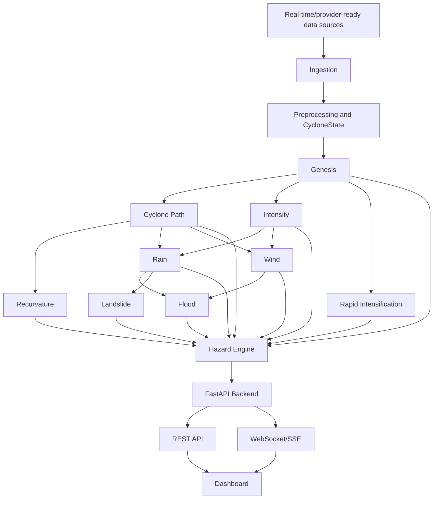

# TOOFAN Final Verification Report

## 1. Executive Summary

TOOFAN has a FastAPI backend, provider layer, parallel DAG orchestrator, model adapters, hazard engine, WebSocket/SSE event layer, and demo-first React dashboard. The final verification pass created the Phase 28 documentation set and verified the current implementation without retraining models, replacing artifacts, changing the DAG, or altering serial-path semantics.

Final pytest matched the known baseline: 295 passed, 0 failed, 0 errors, 972 warnings in 79.61s.

## 2. Final Architecture



## 3. Pipeline DAG

Exact dependency graph:

```text
genesis -> []
trajectory -> genesis
intensity -> genesis
ri -> genesis
rainfall -> trajectory, intensity
wind -> trajectory, intensity
flood -> rainfall, wind
landslide -> rainfall
recurvature -> trajectory
hazard_engine -> genesis, trajectory, intensity, ri, rainfall, wind, flood, landslide, recurvature
```

Production service execution uses `execute_parallel(...)`. The serial `execute()` path remains intentionally different and the `for dep in required_upstream:` loop was verified present.

## 4. Model Registry

| Module | Artifact | Adapter | Input | Output | Model Status | Pipeline Status |
|---|---|---|---|---|---|---|
| Genesis | `genisis models/tc_genesis_lightgbm_300_OPTIMIZED.joblib` | `src/models/genesis/adapter.py` | 34 environmental features | `GenesisPrediction` | VERIFIED | DEGRADED |
| Cyclone Path | `best_cyclone_model_lt3p_distilled.pth`, `scalers.pkl` | `src/models/adapters/trajectory_adapter.py` | track history | `TrackPrediction` | VERIFIED | DEGRADED |
| Intensity | `cyclone intensity/models/final_xgb_regressor.joblib` | `src/models/adapters/intensity_adapter.py` | 30 storm/env features | `IntensityPrediction` | NOT_AVAILABLE | NOT_AVAILABLE |
| Rapid Intensification | `RI/models/imd_ri_model.json`, fusion artifact | `src/models/ri/adapter.py` | IMD/ERA5 features | `RIPrediction` | VERIFIED | DEGRADED |
| Recurvature | `recurvature/xgb_recurve_model.json` | `src/models/adapters/recurvature_adapter.py` | track curvature features | `RecurvaturePrediction` | VERIFIED | DEGRADED |
| Rain | `rain/model/rainfall_classifier_12.pkl`, regressor | `src/models/rainfall/adapter.py` | IMERG case-study features | `RainfallPrediction` | VERIFIED | BASELINE |
| Flood | `flood/model/flood_xgboost_improved.pkl` | `src/models/flood/adapter.py` | rainfall/wind/static features | `FloodPrediction` | VERIFIED | DEGRADED |
| Wind model | `wind/model/wind_model_best.keras` | `src/models/wind/adapter.py` | `(None, 6, 81, 57, 2)` U10/V10 | `WindFieldPrediction` | VERIFIED | NOT_AVAILABLE without provider |
| Landslide | none | `src/models/landslide/adapter.py` | rainfall/terrain | `LandslidePrediction` | BASELINE | BASELINE/NOT_AVAILABLE |
| Hazard Engine | none | `src/pipeline/hazard_engine.py` | usable module outputs | `UnifiedForecastState` | VERIFIED | VERIFIED |

## 5. Data Providers

| Provider | Data | Source | Cache | Retry | Staleness | Status |
|---|---|---|---|---|---|---|
| `cyclone_track` | IMD/IBTrACS best track | local configured files | optional TTL | provider-specific/common | configured threshold | AVAILABLE if file exists |
| `weather_era5` | ERA5 pressure-level/features | local CSV/NetCDF | optional TTL | common | configured threshold | AVAILABLE/DEGRADED |
| `rainfall_imerg` | observed IMERG precipitation | `rain/data` | optional TTL | common | configured threshold | AVAILABLE/DEGRADED |
| `satellite` | IR imagery/features | configured RI satellite dirs | optional TTL | common | configured threshold | AVAILABLE only if archive exists |
| `ocean_cmems` | CMEMS ocean fields | `RI/models/cmems_*.nc` | optional TTL | common | configured threshold | AVAILABLE/DEGRADED |
| `terrain` | static terrain rasters | configured flood paths | optional TTL | common | configured threshold | NOT_AVAILABLE unless rasters exist |
| `gridded_wind` | U10/V10 six-frame grids | no shipped source | optional TTL | not applicable | not applicable | NOT_AVAILABLE |

U10/V10 production provider is explicitly missing. ERA5 pressure-level data is not a complete replacement for the required wind model input contract.

## 6. Backend API

| Method | Endpoint | Purpose | Status |
|---|---|---|---|
| GET | `/api/v1/health/` | health/provider summary | VERIFIED |
| GET | `/api/v1/models/` | registry listing | VERIFIED |
| GET | `/api/v1/data/sources` | provider availability | VERIFIED |
| POST | `/api/v1/pipeline/run` | full DAG run | VERIFIED |
| POST | `/api/v1/pipeline/validate` | request validation | VERIFIED |
| GET | `/api/v1/assessment/{request_id}` | stored run result | VERIFIED |
| GET | `/api/v1/hazards/{hazard}/{request_id}` | per-hazard result | VERIFIED |
| GET/POST | `/api/v1/genesis` | genesis status/run | VERIFIED |
| GET/POST | `/api/v1/cyclone/path` | path status/run | VERIFIED |
| GET | `/api/v1/stream/pipeline_events` | SSE events | IMPLEMENTED |
| WebSocket | `/api/v1/ws/assessment/{event_id}` | assessment snapshot/events | VERIFIED |

## 7. Real-Time Execution

The run flow is provider snapshot -> `CycloneState` assembly -> parallel DAG -> lifecycle events -> run store -> REST/WebSocket/SSE access. Events include `pipeline_started`, `state`, `pipeline`, `genesis_completed`, `cyclone_path_completed`, `hazard_branch_completed`, `pipeline_completed`, `pipeline_degraded`, and `pipeline_failed`.

## 8. Failure Handling

Provider, model, and dependency failures stay visible through `AVAILABLE`, `DEGRADED`, `BASELINE`, `NOT_AVAILABLE`, and `ERROR`. Missing U10/V10 wind input does not produce fabricated wind fields. Independent DAG branches continue when unrelated branches fail.

## 9. Testing

| Check | Command | Result |
|---|---|---|
| Full pytest | `python3 -m pytest tests/ -q` | 295 passed, 0 failed, 0 errors, 972 warnings, 79.61s |
| Frontend build | `npm run build` in `frontend/` | passed, Vite built in 3.71s |
| Python lint | `python3 -m ruff check .` | failed on existing repository issues: 1030 errors, including legacy notebook syntax errors, unused imports, unsorted imports, undefined names |
| Frontend lint | `npm run lint` in `frontend/` | passed |
| API tests | included in full pytest, `tests/integration/test_backend_api.py` | passed |
| Model tests | included in full pytest | passed |
| DAG/concurrency tests | included in full pytest, `tests/test_pipeline_e2e.py` | passed |

Compared with the known 295-pass baseline, final pytest is unchanged. No new pytest failures or errors appeared.

## 10. Files Created

- `docs/architecture.md`
- `docs/pipeline.md`
- `docs/model_registry.md`
- `docs/data_sources.md`
- `docs/api.md`
- `docs/realtime.md`
- `docs/failure_handling.md`
- `docs/FINAL_VERIFICATION_REPORT.md`

## 11. Files Modified

- `docs/model_inventory.md`
- `docs/model_audit/model_health_check.md`
- `docs/model_audit/model_health_check.json`

These three existing docs were corrected for the trajectory deployment fallback to `cyclone_path_deployment_package_v7b/`.

## 12. Files Removed

None during this final phase.

## 13. Known Limitations

- U10/V10 production provider is not shipped.
- External provider availability depends on local configured files; this is provider-ready, not complete live operations for every source.
- Historical trajectory/recurvature native compatibility warnings remain warnings, not final failures.
- Frontend remains demo-first.
- Ruff has many existing repository violations outside the final documentation work.
- Native/runtime warnings include Pydantic v2 deprecations, `datetime.utcnow()` deprecations, sklearn version warnings, and expected missing registry warnings in tests.
- Stale-data behavior is implemented, but operational freshness depends on configured `stale_after_s`.

## 14. Final Stage Status

Data ingestion: ⚠️ DEGRADED  
Preprocessing: ✅ VERIFIED  
Genesis: ⚠️ DEGRADED  
Cyclone Path: ⚠️ DEGRADED  
Recurrence/Recurvature: ⚠️ DEGRADED  
Intensity: 🟡 PROVIDER REQUIRED  
Rapid Intensification: ⚠️ DEGRADED  
Rain: ⚠️ DEGRADED  
Flood: ⚠️ DEGRADED  
Wind model: ✅ VERIFIED  
Wind grid inference: ✅ VERIFIED  
Wind real-world provider: 🟡 PROVIDER REQUIRED  
Landslide: ⚠️ DEGRADED  
Hazard Engine: ✅ VERIFIED  
Parallel DAG: ✅ VERIFIED  
FastAPI backend: ✅ VERIFIED  
Real-time event layer: ✅ VERIFIED  
Frontend: ✅ VERIFIED  
Documentation: ✅ VERIFIED  

## 15. Final Conclusion

The finalization pass completed the requested documentation, verified the 295-test baseline, verified frontend build and frontend lint, ran configured Python lint, checked stale references, verified API coverage through tests, verified DAG semantics and the intact serial `required_upstream` loop, and confirmed canonical model artifacts still exist.

The system is verified as an honest research/hackathon forecasting stack with a parallel backend DAG and explicit degradation. Remaining completeness depends on external/provider work, especially a legitimate production U10/V10 gridded wind provider.
