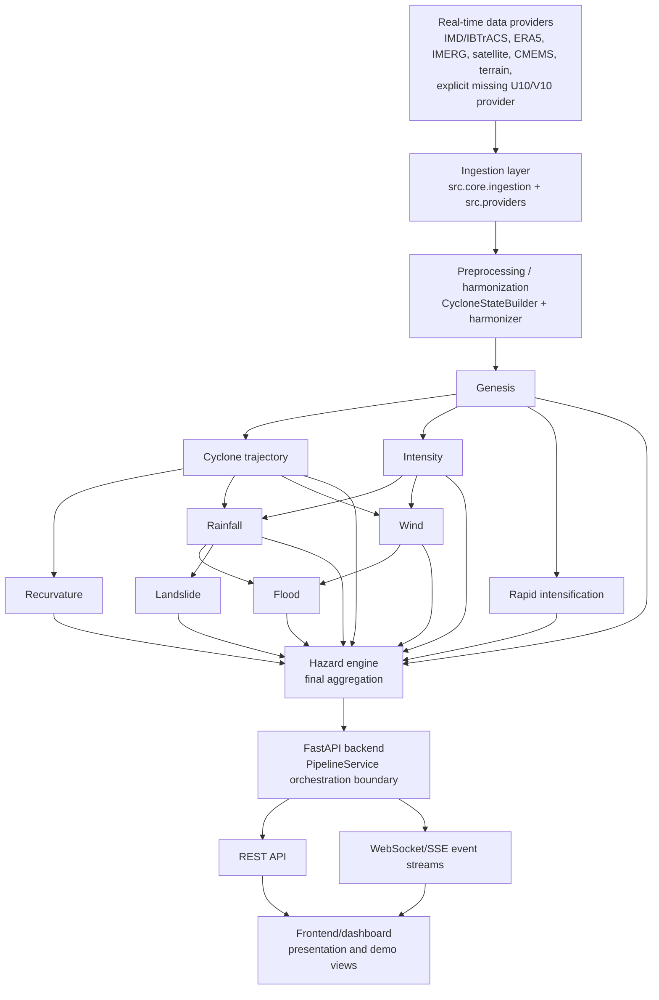

# TOOFAN Architecture

TOOFAN is a research engineering tropical-cyclone forecasting stack. The backend is the single orchestration boundary: it owns provider access, state assembly, DAG execution, status propagation, hazard aggregation, and API/WebSocket exposure. The React frontend is presentation/demo-first and does not contain ML orchestration logic.

## System Flow

## Boundaries

The backend entry point is `backend/app/main.py`. It builds a `PipelineService`, a provider registry, and a `PipelineOrchestrator` from `configs/pipeline.yaml`. Request handlers in `backend/app/routers/*` delegate to that service instead of loading models directly.

`PipelineService.run()` is the production run boundary. It validates `PipelineRunRequest`, builds a `CycloneState`, snapshots providers, executes the DAG through `execute_parallel(...)`, composes per-hazard statuses, stores the run in memory, and emits lifecycle events.

Model adapters live under `src/models/**/adapter.py` and `src/models/adapters/*.py`. They translate `CycloneState` and upstream prediction objects into the legacy model contracts while preserving honest runtime statuses.

The frontend under `frontend/` is intentionally demo-first. It can display API output, mock dashboard data, and status labels, but it does not execute the ML DAG, talk to providers, or fabricate backend predictions.

## Dependency Modes

Synchronous dependencies are enforced by the DAG. Genesis gates trajectory, intensity, and RI. Rainfall and wind require trajectory plus intensity. Flood requires rainfall plus wind. Landslide requires rainfall.

Parallel branches execute concurrently once their dependencies are satisfied. After genesis, trajectory, intensity, and RI are independent. After trajectory and intensity complete, rainfall and wind are independent. Hazard aggregation waits for all requested modules to settle with either success, unavailable, or failure status.

The serial `execute()` path remains a legacy path with intentionally different gating semantics. Production service code uses `execute_parallel(...)`.
