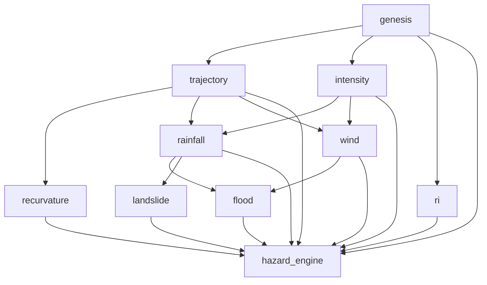

# TOOFAN Pipeline

The pipeline converts a validated storm request into a `UnifiedForecastState` plus run metadata. Production API execution uses `PipelineService.run()`, which calls `PipelineOrchestrator.execute_parallel(...)` with a dependency-aware DAG.

## Run Contracts

`PipelineRunRequest` includes `storm_id`, `basin`, `reference_time`, optional `latitude` and `longitude`, optional module subset, mode (`full`, `genesis_only`, `track_only`, `hazard_only`), optional `request_id`, and optional `max_workers`.

`PipelineRunResult` wraps the run envelope: `request_id`, `run_id`, generated time, pipeline status, `UnifiedForecastState`, per-hazard status map, per-hazard reasons, provider provenance, latency fields, and warnings.

`UnifiedForecastState` contains the `CycloneState`, module outputs, hazard summary, model versions, module execution statuses, module reasons, assessed/unassessed hazard lists, uncertainty summary, explanations, and overall confidence.

## Authoritative DAG

The authoritative dependency graph is `PipelineOrchestrator.DEFAULT_DEPENDENCIES`:

```text
genesis -> []
trajectory -> genesis
intensity -> genesis
ri -> genesis
rainfall -> trajectory, intensity
wind -> trajectory, intensity
flood -> rainfall, wind
landslide -> rainfall
recurvature -> trajectory
hazard_engine -> genesis, trajectory, intensity, ri, rainfall, wind, flood, landslide, recurvature
```



## Execution Waves

`execute_parallel(...)` schedules modules whose direct dependencies have completed. The executor uses a bounded `ThreadPoolExecutor` and does not serialize independent branches.

Typical full execution waves are:

1. `genesis`
2. `trajectory`, `intensity`, `ri`
3. `recurvature`, `rainfall`, `wind`
4. `flood`, `landslide`
5. `hazard_engine`

If a requested dependency is absent from the requested module set, the dependent module is marked `UNAVAILABLE`. If a dependency fails or is unavailable, downstream dependent modules are marked `UNAVAILABLE` with a reason. Unrelated branches continue.

## Injected CycloneState

`execute_parallel(...)` accepts `cyclone_state`. When supplied, the orchestrator uses that state directly instead of building one through the ingestion and harmonization layer. This is used by tests and controlled callers to verify DAG behavior without invoking external data loaders.

## Serial Versus Parallel Semantics

The production service uses only:

```python
execute_parallel(
    storm_id,
    basin,
    reference_time,
    modules,
    mode,
    max_workers,
    cyclone_state=None,
)
```

The serial `execute()` path is intentionally legacy-compatible and is not equivalent to the full parallel DAG. It keeps a local `required_upstream` map for rainfall, wind, flood, and landslide, and intentionally does not gate `genesis -> trajectory` in the same way. Tests pin this behavior.

## Status Propagation

Execution results use `SUCCESS`, `FAILED`, or `UNAVAILABLE`. The API hazard status map exposes:

| Status | Meaning |
|---|---|
| `AVAILABLE` | Real model/provider output was produced. |
| `DEGRADED` | Output exists but is limited, unverified, partial, or stale. |
| `BASELINE` | A documented baseline or case-study output, not a complete verified forecast. |
| `NOT_AVAILABLE` | Artifact, provider, dependency, or usable input is absent. |
| `ERROR` | A module or provider raised an execution error. |

Adapters may return their own status fields. `UNAVAILABLE`, `DATA_UNAVAILABLE`, `RUNTIME_REQUIRED`, `NOT_IMPLEMENTED`, and `MODEL_MISSING` are downgraded to unavailable execution results so missing data cannot masquerade as a successful forecast.
